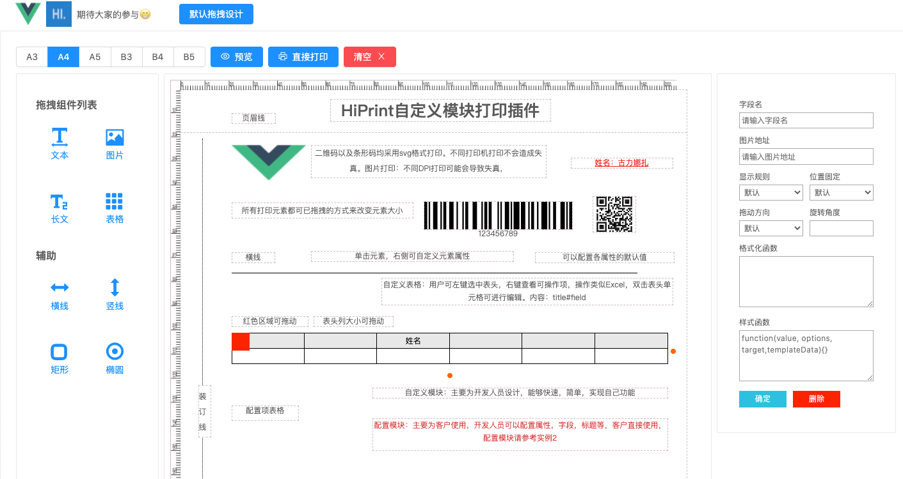
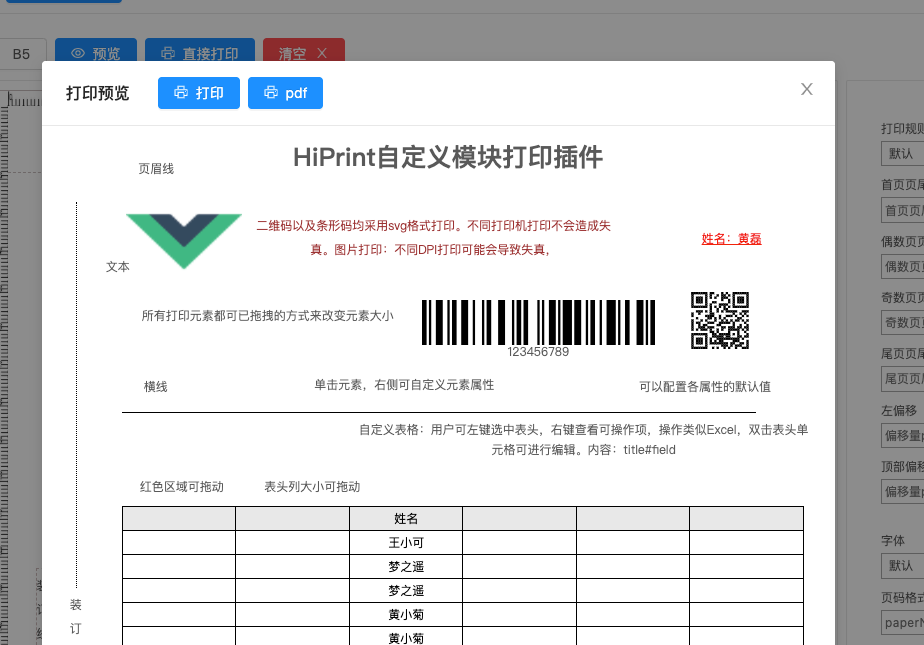

<div align="center" style="margin-top: 10px">
  <a href="http://hiprint.io/">
    
  </a>
  <a href="https://cn.vuejs.org/">
    
  </a>
</div>

[![npm][npm]][npm-url]
[![node][node]][node-url]


# vue-plugin-hiprint
> hiprint for vue2.0

## 参与/预览 <a href="https://ccsimple.gitee.io/vue-plugin-hiprint/">demo</a>
```console
git clone https://github.com/CcSimple/vue-plugin-hiprint.git
// or
git clone https://gitee.com/CcSimple/vue-plugin-hiprint.git
// init
cd vue-plugin-hiprint
npm i
// 调试预览
npm run serve
// 打包
npm run build
```

## 安装
```console
npm install vue-plugin-hiprint
```
## 全局使用
```javascript
// main.js中 引入安装
import {hiPrintPlugin} from 'vue-plugin-hiprint'
Vue.use(hiPrintPlugin, '$pluginName')
// 然后使用
this.$pluginName

// 例如
this.$pluginName.init();
var hiprintTemplate = new this.$pluginName.PrintTemplate();
var panel = hiprintTemplate.addPrintPanel({ width: 100, height: 130, paperFooter: 340, paperHeader: 10 });
//文本
panel.addPrintText({ options: { width: 140, height: 15, top: 20, left: 20, title: 'hiprint插件手动添加text', textAlign: 'center' } });
//条形码
panel.addPrintText({ options: { width: 140, height: 35, top: 40, left: 20, title: '123456', textType: 'barcode' } });
//二维码
panel.addPrintText({ options: { width: 35, height: 35, top: 40, left: 165, title: '123456', textType: 'qrcode' } });
//长文本
panel.addPrintLongText({ options: { width: 180, height: 35, top: 90, left: 20, title: '长文本：hiprint是一个很好的webjs打印,浏览器在的地方他都可以运行' } });
//表格
panel.addPrintTable({ options: { width: 252, height: 35, top: 130, left: 20, content: $('#testTable').html() } });
//Html
panel.addPrintHtml({ options: { width: 140, height: 35, top: 180, left: 20, content:'' } });
//竖线//不设置宽度
panel.addPrintVline({ options: { height: 35, top: 230, left: 20 } });
//横线 //不设置高度
panel.addPrintHline({ options: { width: 140, top: 245, left: 120 } });
//矩形
panel.addPrintRect({ options: { width: 35, height: 35, top: 230, left: 60 } });
//打印
hiprintTemplate.print({});
//直接打印，需要安装客户端
hiprintTemplate.print2({});
```
## 自定义设计 （详情查看demo目录）
```javascript
import {hiprint,defaultElementTypeProvider} from 'vue-plugin-hiprint'
hiprint.init({
  providers: [new defaultElementTypeProvider()]
})
hiprint.PrintElementTypeManager.buildByHtml($('.ep-draggable-item'));
hiprintTemplate = new hiprint.PrintTemplate({
  template: {},
  settingContainer: '#PrintElementOptionSetting',
  paginationContainer: '.hiprint-printPagination'
});
hiprintTemplate.design('#hiprint-printTemplate');
```

## 常见问题
> design时怎么修改默认图片？
```vue
<!-- 组件内, 显示的图片-->
<style lang="less" scoped>
/deep/ .hiprint-printElement-image-content {
  img {
    content: url("~@/assets/logo.png");
  }
}
</style>
<!-- App.vue 拖拽时显示的图片-->
<!-- 不要 scoped, 拖拽时是添加到 html body内的-->
<style lang="less">
.hiprint-printElement-image-content {
  img {
    content: url("~@/assets/logo.png");
  }
}
</style>
```
> print/print2 打印回调
```javascript
// 浏览器预览打印
hiprintTemplate.print(this.printData, {}, {
  callback: () => {
    console.log('浏览器打印窗口已打开')
  }
})
// 直接打印
hiprintTemplate.print2(printData, {printer: '打印机名称', title: '打印标题'})
hiprintTemplate.on('printSuccess', function (data) {
  console.log('打印完成')
})
hiprintTemplate.on('printError', function (data) {
  console.log('打印失败')
})
```
> 打印重叠 / 样式问题
```javascript
// 开发时默认用的Ant Design Vue， 所有其他ui框架没有测试过
// 自0.0.13起， 可自定义样式处理
hiprintTemplate.print(this.printData, {}, {
  styleHandler: () => {
    let css = ''
    // xxxxx
    return css
  }
})
// 直接打印
hiprintTemplate.print2(this.printData, {
  styleHandler: () => {
    let css = ''
    // xxxxx
    return css
  }
})
```
> 修改默认配置 / 显示/隐藏元素设置参数
```javascript
// 0.0.13， 新增setConfig方法
// 还原配置
hiprint.setConfig()
// 替换配置
hiprint.setConfig({
  movingDistance: 2.5,
  text:{
    supportOptions: [
      {
        name: 'styler',
        hidden: true
      },
      {
        name: 'formatter',
        hidden: true
      },
    ]
  }
})
```

## 交流群
<div align="center">


</div>
若过期 加我 备注加群

## 演示/截个图咯~
<div align="center">




</div>

## 状态/调整/优化
- [x] `vue 插件` 发布npm包,方便直接使用
- [x] `Ant Design Vue` 默认demo
- [x] `优化删除元素功能` 支持 backSpace/delete 按键删除
- [x] `优化拖动功能` fix 元素拖出窗口外的问题
- [x] `优化框选功能` fix 原只能从上往下框选问题
- [x] `支持修改默认直接打印主机` window.hiwebSocket.setHost("xxx:17521")
- [x] `print优化调整` 支持设置callback 见demo的preview.vue
- [x] `table/tableCustom优化调整` 支持设置options.fields 双击选择字段,
- [x] `table优化调整` 支持设置isEnableInsertColumn/isEnableDeleteColumn等参数，支持插入/删除列
- [x] `table/tableCustom优化调整` 支持设置options.tableHeaderRepeat/tableFooterRepeat 表头/表脚显示模式

### 咳咳..
第一次写插件(webpack打包这些都不太了解)，不合理的地方欢迎指正<a href="https://github.com/CcSimple/vue-plugin-hiprint/issues">issues</a>。
简单的修改了下`hiprint.bundle.js`引入了相关资源,然后`export hiprint,defaultElementTypeProvider`
#### 详见源码<a href="https://github.com/CcSimple/vue-plugin-hiprint">vue-plugin-hiprint</a>

#### 呃呃.. 记录一下处理过程
> webpack 配置
```javascript
{
  // 引用本地资源, 一些源码中 require('xxx') 需要处理
  resolve: {
    alias: {
      'vue$': 'vue/dist/vue.esm.js',
      'jquery$': path.resolve(__dirname, "./src/hiprint/plugins/jq-3.31.js"),
      // 这两个资源在 plugins/jspdf/canvg.min.js 中的需要
      'rgbcolor$': path.resolve(__dirname, "./src/hiprint/plugins/jspdf/rgbcolor.js"),
      'stackblur-canvas$': path.resolve(__dirname, "./src/hiprint/plugins/jspdf/stackblur-canvas.js"),
    }
  },
  // 全局jQuery问题
  plugins: [
    new webpack.ProvidePlugin({
      jQuery: "jquery",
      $: "jquery"
    }),
  ],
  // 资源处理
  module: {
    rules: [
      // url-loader 处理 jquery.minicolors.png， 转成base64
      {
        test: /\.(png|jpg|gif|svg)$/,
        loader: 'url-loader',
        options: {
          name: '[name].[ext]'
        }
      }
    ]
  }
}
```


[npm]: https://img.shields.io/npm/v/vue-plugin-hiprint.svg
[npm-url]: https://npmjs.com/package/vue-plugin-hiprint
[node]: https://img.shields.io/node/v/vue-plugin-hiprint.svg
[node-url]: https://nodejs.org
