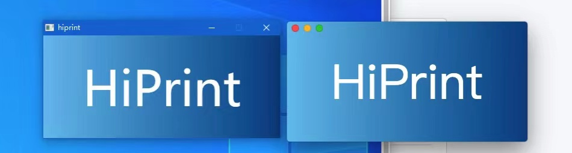
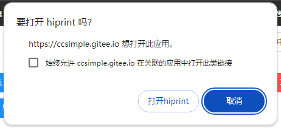

<div align="center" style="margin-top: 10px">
  <a href="http://hiprint.io/">
    
  </a>
  <a href="https://cn.vuejs.org/">
    
  </a>
</div>


<a href="https://gitee.com/CcSimple/vue-plugin-hiprint">

</a>
<a href="https://gitee.com/CcSimple/vue-plugin-hiprint">

</a>


## 关于此插件

vue-plugin-hiprint (基于 [hiprint 2.5.4](http://hiprint.io/)) 当时只是为了方便 <span style="color: red">我（并非hiprint原作者）</span> 在vue项目中引入使用，所以以此命名。

此 <span style="color: red">插件</span> 仅仅是一个 <span style="color: red">JavaScript【工具库】</span> 而非 <span style="color: yellow">Vue【组件库】</span>，所以它默认不包含demo中的那些组件页面（demo代码可复制使用）。

由于hiprint官网最后一次更新时间为2019年【hiprint 2.5.4 是 [LGPL](#关于lgpl协议) 协议】，后在诸多使用者及反馈下进行了许多优化调整。

[更新日志](CHANGELOG.md)（感谢各位群友支持和参与）

## vue-plugin-hiprint [更新日志](CHANGELOG.md)
> hiprint for Vue2.x / Vue3.x (基于jQuery, 理论上应该也是支持其他框架的)

> **jQuery/uniapp** 项目 见下方 [jQuery/uniapp 项目使用](#jQuery/uniapp 项目使用)

## 注意事项!!

- NodeJs 需要 16.x 版本 (开发使用的 16.18.1)
- <div style="color: red">【vue-plugin-hiprint】与【hiprint.io官网】差异甚多,请忽混用!请忽混用!请忽混用!</div>
- <div style="color: orange">请使用我提供的打印客户端,或者自行修改打印客户端的源码,以适配本项目的模板!</div>
- 主分支是融合版本的最新代码,如果你不需要修改 hiprint 相关代码. 请使用 npm 包的方式安装.
- 使用直接客户端时,本地开发连接没问题,部署到线上出现跨域无法连接打印客户端问题:
- [线上跨域问题,请升级 https! 说明:https://www.cnblogs.com/daysme/p/15493523.html](https://www.cnblogs.com/daysme/p/15493523.html)
- 如需提交 PR 请前往 github 合并后可自动发布npm包并同步代码到 gitee
- vue-plugin-hiprint 包不包含UI界面,需要自行处理。如果想更快速引入请查看 [sv-print组件库](https://ccsimple.github.io/sv-print-docs/)

## 快速链接

Demo预览：[https://ccsimple.gitee.io/vue-plugin-hiprint/](https://ccsimple.gitee.io/vue-plugin-hiprint/)(已挂，恢复看gitee官方情况)

Github Demo预览：[https://ccsimple.github.io/vue-plugin-hiprint/](https://ccsimple.github.io/vue-plugin-hiprint/)(慢，需翻墙)

更新记录：[npm包版本及更新记录](CHANGELOG.md)

打印客户端：[https://gitee.com/CcSimple/electron-hiprint](https://gitee.com/CcSimple/electron-hiprint)

中转服务：[https://github.com/Xavier9896/node-hiprint-transit](https://github.com/Xavier9896/node-hiprint-transit)

## 文章链接

入门篇: [【vue-plugin-hiprint】使用-入门篇](https://mp.weixin.qq.com/s/4N4f7CkxodA-fuTJ_FbkOQ)

进阶篇: [【vue-plugin-hiprint】使用-进阶篇](https://mp.weixin.qq.com/s/LYZP2iqV0gy4m76mttplAw)

provider: [【vue-plugin-hiprint】如何自定义可拖拽元素 provider](https://mp.weixin.qq.com/s/n9i1j8hhVJvnlfJRPRtWog)

打印篇: [【vue-plugin-hiprint】使用-打印篇](https://mp.weixin.qq.com/s/P-Zz8YfELmRNi4EuED4QmA)

参数篇: [【vue-plugin-hiprint】使用-参数篇](https://mp.weixin.qq.com/s/vfgSG62tAXn7Ot7y3x68fw)

实战动态provider: [【vue-plugin-hiprint】实战-动态provider](https://mp.weixin.qq.com/s/UVkhul1tynjaUjdC_NaHfw)

实战动态模板: [【vue-plugin-hiprint】实战-动态模板](https://mp.weixin.qq.com/s/JXXC9Fyy_PgPXrwh1mDBTQ)

常见问题汇总①: [【vue-plugin-hiprint】常见问题汇总①](https://mp.weixin.qq.com/s/E-ZfuKLH3-GvKn4AosRvaw)

常见问题汇总②: [【vue-plugin-hiprint】常见问题汇总②](https://mp.weixin.qq.com/s/UEnr24bB_P6KmpZ7iZmYvA)

常见问题汇总③: [【vue-plugin-hiprint】常见问题汇总③](https://mp.weixin.qq.com/s/lRimQ-cjuwN3mg6RicPyag)

## 更多参数的文档请仔细查阅文档

hiprint官方文档：[http://hiprint.io/docs/start](http://hiprint.io/docs/start)

本人写的部分文档: [https://ccsimple.github.io/sv-print-docs/config/hiprint.html](https://ccsimple.github.io/sv-print-docs/config/hiprint.html)

## 安装使用
```
npm install vue-plugin-hiprint
```

```html
<!--【必须】在index.html 文件中添加打印所需样式(cdn可能不稳定):-->
<link rel="stylesheet" type="text/css" media="print" href="https://npmmirror.com/package/vue-plugin-hiprint/files/dist/print-lock.css">
<!-- OR -->
<link rel="stylesheet" type="text/css" media="print" href="https://cdn.jsdelivr.net/npm/vue-plugin-hiprint@latest/dist/print-lock.css">
<!-- 可以调整成 相对链接/自有链接, 【重要】名称需要一致 【print-lock.css】-->
<link rel="stylesheet" type="text/css" media="print" href="/print-lock.css">
```

## 项目截图
<table>
    <tr>
        <td></td>
        <td></td>
    </tr>
    <tr>
        <td></td>
        <td></td>
    </tr>
    <tr>
        <td></td>
        <td></td>
    </tr>
</table>


## 拖拽设计使用
```javascript
import {hiprint,defaultElementTypeProvider} from 'vue-plugin-hiprint'
// 初始化可拖拽的元素
hiprint.init({
  providers: [new defaultElementTypeProvider()]
})
// $('.ep-draggable-item') 包含 tid, 与上边的 provider 中的 tid 对应 才能正常拖拽生成元素
hiprint.PrintElementTypeManager.buildByHtml($('.ep-draggable-item'));
hiprintTemplate = new hiprint.PrintTemplate({
  template: {}, // 模板json
  settingContainer: '#PrintElementOptionSetting', // 元素参数容器
  paginationContainer: '.hiprint-printPagination', // 多面板的容器， 实现多面板， 需要在添加一个 <div class="hiprint-printPagination"/>
  // ------- 下列是可选功能 -------
  // ------- 下列是可选功能 -------
  // ------- 下列是可选功能 -------
  // 图片选择功能
  onImageChooseClick: (target) => {
    // 测试 3秒后修改图片地址值
    setTimeout(() => {
      // target.refresh(url,options,callback)
      // callback(el, width, height) // 原元素,宽,高
      // target.refresh(url,false,(el,width,height)=>{
      //   el.options.width = width;
      //   el.designTarget.css('width', width + "pt");
      //   el.designTarget.children('.resize-panel').trigger($.Event('click'));
      // })
      target.refresh("data:image/png;base64,iVBORw0KGgoAAAANSUhEUgAAAtAAAAIIAQMAAAB99EudAAAABlBMVEUmf8vG2O41LStnAAABD0lEQVR42u3XQQqCQBSAYcWFS4/QUTpaHa2jdISWLUJjjMpclJoPGvq+1WsYfiJCZ4oCAAAAAAAAAAAAAAAAAHin6pL9c6H/fOzHbRrP0tLS0tLS0tLS0tLS0tLS0tLS0tLS0tLS0tLS0u/SY9LS0tLS0tLS0tLS0n+edm+UlpaWlpaWlpaWlpaW/tl0Ndyzbno7/+tPTJdd1wal69dNa6abx+Lq6TSeYtK7BX/Diek0XULSZZrakPRtV0i6Hu/KIt30q4fM0pvBqvR9mvsQkZaW9gyJT+f5lsnzjR54xAk8mAUeJyMPwYFH98ALx5Jr0kRLLndT7b64UX9QR/0eAAAAAAAAAAAAAAAAAAD/4gpryzr/bja4QgAAAABJRU5ErkJggg==",{
        // auto: true, // 根据图片宽高自动等比(宽>高?width:height)
        // width: true, // 按宽调整高
        // height: true, // 按高调整宽
        real: true // 根据图片实际尺寸调整(转pt)
      })
    }, 3000)
    // target.getValue()
    // target.refresh(url)
  },
  // 自定义可选字体
  // 或者使用 hiprintTemplate.setFontList([])
  // 或元素中 options.fontList: []
  fontList: [
    {title: '微软雅黑', value: 'Microsoft YaHei'},
    {title: '黑体', value: 'STHeitiSC-Light'},
    {title: '思源黑体', value: 'SourceHanSansCN-Normal'},
    {title: '王羲之书法体', value: '王羲之书法体'},
    {title: '宋体', value: 'SimSun'},
    {title: '华为楷体', value: 'STKaiti'},
    {title: 'cursive', value: 'cursive'},
  ],
  dataMode: 1, // 1:getJson 其他：getJsonTid 默认1
  history: true, // 是否需要 撤销重做功能
  onDataChanged: (type, json) => { // 模板发生改变回调
    console.log(type); // 新增、移动、删除、修改(参数调整)、大小、旋转
    console.log(json); // 返回 template
  },
  onUpdateError: (e) => { // 更新失败回调
    console.log(e);
  },
});
// 设计器的容器
hiprintTemplate.design('#hiprint-printTemplate');
```

## 代码模式使用

```javascript
import {hiprint, defaultElementTypeProvider} from 'vue-plugin-hiprint'
// 引入后使用示例
hiprint.init();
// 下列方法都是没有拖拽设计页面的, 相当于代码模式, 使用代码设计页面
// 想要实现拖拽设计页面,请往下看 '自定义设计'
var hiprintTemplate = new hiprint.PrintTemplate();
var panel = hiprintTemplate.addPrintPanel({ width: 100, height: 130, paperFooter: 340, paperHeader: 10 });
//文本
panel.addPrintText({ options: { width: 140, height: 15, top: 20, left: 20, title: 'hiprint插件手动添加text', textAlign: 'center' } });
//条形码
panel.addPrintText({ options: { width: 140, height: 35, top: 40, left: 20, title: '123456', textType: 'barcode' } });
//二维码
panel.addPrintText({ options: { width: 35, height: 35, top: 40, left: 165, title: '123456', textType: 'qrcode' } });
//长文本
panel.addPrintLongText({ options: { width: 180, height: 35, top: 90, left: 20, title: '长文本：hiprint是一个很好的webjs打印,浏览器在的地方他都可以运行' } });
//打印
hiprintTemplate.print({});
```

## i18n 设置 ⬆️ 0.0.55-beta8

原生为简体中文，英语、德语、西班牙语、法语、意大利语、日语、俄语、繁体中文皆为 AI 机翻，欢迎帮助 [订正](https://github.com/CcSimple/vue-plugin-hiprint/tree/main/src/i18n)。

可在 init 时传入语言进行设置，默认为 `cn` 。

```js
hiprint.init({
  lang: 'en', // 设置语言 ['cn', 'en', 'de', 'es', 'fr', 'it', 'ja', 'ru', 'cn_tw']
});
```

## 直接打印 地址端口 与 Token 设置

```js
hiprint.init({
  host: 'http://localhost:17521', // 可在此处设置连接地址与端口号
  token: 'token', // 可在此处设置连接 token 可缺省
});
```

## vue/vue3 全局引入

> 全局引入，方便在任何地方不引入直接调用打印。示例为代码模式 (拖拽设计请往下看)

```javascript
// main.js中 引入安装
import {hiPrintPlugin} from 'vue-plugin-hiprint'
Vue.use(hiPrintPlugin, '$pluginName')
hiPrintPlugin.disAutoConnect(); // 取消自动连接直接打印客户端

// 下列代码为示例，不要再 main.js中 使用
// 引入后使用示例
this.$pluginName.init();
// 下列方法都是没有拖拽设计页面的, 相当于代码模式, 使用代码设计页面
// 想要实现拖拽设计页面,请往下看 '自定义设计'
var hiprintTemplate = new this.$pluginName.PrintTemplate();
var panel = hiprintTemplate.addPrintPanel({ width: 100, height: 130, paperFooter: 340, paperHeader: 10 });
//文本
panel.addPrintText({ options: { width: 140, height: 15, top: 20, left: 20, title: 'hiprint插件手动添加text', textAlign: 'center' } });
//条形码
panel.addPrintText({ options: { width: 140, height: 35, top: 40, left: 20, title: '123456', textType: 'barcode' } });
//二维码
panel.addPrintText({ options: { width: 35, height: 35, top: 40, left: 165, title: '123456', textType: 'qrcode' } });
//长文本
panel.addPrintLongText({ options: { width: 180, height: 35, top: 90, left: 20, title: '长文本：hiprint是一个很好的webjs打印,浏览器在的地方他都可以运行' } });
//表格
panel.addPrintTable({ options: { width: 252, height: 35, top: 130, left: 20, content: $('#testTable').html() } });
//Html
panel.addPrintHtml({ options: { width: 140, height: 35, top: 180, left: 20, content:'' } });
//竖线//不设置宽度
panel.addPrintVline({ options: { height: 35, top: 230, left: 20 } });
//横线 //不设置高度
panel.addPrintHline({ options: { width: 140, top: 245, left: 120 } });
//矩形
panel.addPrintRect({ options: { width: 35, height: 35, top: 230, left: 60 } });
//打印
hiprintTemplate.print({});
//直接打印，需要安装客户端
hiprintTemplate.print2({});
```

## jQuery/uniapp 项目使用

> uniapp 需要嵌入到 web 浏览器中.(需要支持 window 全局对象环境)

```html
<!-- index.html -->
<head>
    <!-- 打印样式是必须的，你可以调整成自由链接， 注意名称 print-lock.css -->
    <link rel="stylesheet" type="text/css" media="print" href="https://unpkg.com/vue-plugin-hiprint@latest/dist/print-lock.css" />
    <!-- 下列使用的都是 unpkg提供的 稳定性未知, 建议下载自行处理  -->
    <!-- jquery 必须 -->
    <script src="https://unpkg.com/jquery@3.6.1/dist/jquery.js"></script>
    <!-- 条形码 -->
    <script src="https://unpkg.com/jsbarcode@3.11.5/dist/JsBarcode.all.min.js"></script>
    <!-- 颜色选择器 -->
    <script src="https://unpkg.com/@claviska/jquery-minicolors@2.3.6/jquery.minicolors.min.js"></script>
    <!-- 直接打印(print2)需要 -->
    <script src="https://unpkg.com/socket.io-client@4.5.1/dist/socket.io.min.js"></script>
    <!-- toPdf需要 -->
    <script src="https://unpkg.com/canvg@3.0.10/lib/umd.js"></script>
    <script src="https://unpkg.com/jspdf@2.5.1/dist/jspdf.umd.min.js"></script>
    <script src="https://unpkg.com/html2canvas@1.4.1/dist/html2canvas.js"></script>
    <!-- vue-plugin-hiprint 😃 -->
    <script src="https://unpkg.com/vue-plugin-hiprint@latest/dist/vue-plugin-hiprint.js"></script>
</head>
<body>
<!-- 注意 defer -->
<script defer>
  console.log('vue-plugin-hiprint')
  console.log(window['vue-plugin-hiprint'])
  console.log('hiprint')
  // hiprint 以注入 全局
  console.log(hiprint)
  var autoConnect = window['vue-plugin-hiprint'].autoConnect,
    disAutoConnect = window['vue-plugin-hiprint'].disAutoConnect,
    defaultElementTypeProvider = window['vue-plugin-hiprint'].defaultElementTypeProvider;
</script>
</body>
```

## 配套直接打印客户端(win/mac/linux)[源码链接](https://gitee.com/CcSimple/electron-hiprint)
<div style="color:red">如果使用npm包或者本项目,请使用如下样子的直接打印客户端</div>
<div align="center">



</div>
<div style="color:red">本项目需要上面样式的直接打印客户端; 下载地址:</div>

> [https://gitee.com/CcSimple/electron-hiprint/releases](https://gitee.com/CcSimple/electron-hiprint/releases)

### URLScheme `hiprint://`
> 安装客户端时请 `以管理员身份运行` ，才能成功添加 URLScheme

使用：浏览器地址栏输入 `hiprint://` 并回车



```js
// js
window.open("hiprint://")

// element-ui
this.$alert(`连接【${hiwebSocket.host}】失败！<br>请确保目标服务器已<a href="https://gitee.com/CcSimple/electron-hiprint/releases" target="_blank"> 下载 </a> 并 <a href="hiprint://" target="_blank"> 运行 </a> 打印服务！`, "客户端未连接", {dangerouslyUseHtmlString: true})

// ant-design
this.$error({
  title: "客户端未连接",
  content: (h) => (
    <div>
      连接【{hiwebSocket.host}】失败！
      <br />
      请确保目标服务器已
      <a
        href="https://gitee.com/CcSimple/electron-hiprint/releases"
        target="_blank"
      >
        下载
      </a>
      并
      <a href="hiprint://" target="_blank">
        运行
      </a>
      打印服务！
    </div>
  ),
});
```

## 使用 [中转服务 node-hiprint-transit](https://github.com/Xavier9896/node-hiprint-transit) 实现代理

配套客户端打印一直存在跨域、无法连接局域网其余打印机、跨网段无法连接的问题，所以诞生了这个中转代理服务。在 `electron-hiprint` [v1.0.0.7](https://gitee.com/CcSimple/electron-hiprint/releases) 版本中添加了连接中转服务代理的设置，将会在 `electron-hiprint` 与 `node-hiprint-transit` 间建立通信，`vue-plugin-hiprint` 只需连接中转服务就能获取到所有连接中转服务的打印端信息，并且选择任意打印机进行打印。

连接中转服务只需要修改 host， 添加 token

```js
import { hiprint } from 'vue-plugin-hiprint'

hiprint.init({
    host: 'https://v4.printjs.cn:17521', // 此处输入服务启动后的地址
    token: 'hiprint-17521',     // 用于鉴权的token，hiprint* （*可替换为[0-9a-zA-Z\-_]字符）
});

// or

hiwebSocket.setHost("https://printjs.cn:17521", "vue-plugin-hiprint")
```

具体使用请转至 [node-hiprint-transit](https://github.com/Xavier9896/node-hiprint-transit)

为此你需要作出这些改变：

1. 你可以从 `hiwebSocket` 中获取到 `clients`、`printerList` ，里面都将包含 `client` 信息
2. print2、ippRequest、ippRequest api options 中需要添加 `client` 指定客户端

    eg:
    ```js
    var clientId = "AlBaUCNs3AIMFPLZAAAh"
    var client = hiwebSocket.clients[clientId]
    var printer = hiwebSocket.printerList[0]

    hiprintTemplate.print2(printData, { client: clientId, printer: client.printerList[n].name, title: 'hiprint测试打印' });

    hiprintTemplate.print2(printData, { client: printer.clientId, printer: printer.name, title: 'hiprint测试打印' });
    ```
  > 如果你不提供 client 中转服务将抛出一个 error

## 常见问题

> 可能花几分钟读一读下面的文章就能找到你遇到的问题:

常见问题汇总①: [【vue-plugin-hiprint】常见问题汇总①](https://mp.weixin.qq.com/s/E-ZfuKLH3-GvKn4AosRvaw)

常见问题汇总②: [【vue-plugin-hiprint】常见问题汇总②](https://mp.weixin.qq.com/s/UEnr24bB_P6KmpZ7iZmYvA)

常见问题汇总③: [【vue-plugin-hiprint】常见问题汇总③](https://mp.weixin.qq.com/s/lRimQ-cjuwN3mg6RicPyag)

> design时怎么修改默认图片？
```vue
<!-- 组件内, 显示的图片-->
<style lang="less" scoped>
/deep/ .hiprint-printElement-image-content {
  img {
    content: url("~@/assets/logo.png");
  }
}
</style>
<!-- App.vue 拖拽时显示的图片-->
<!-- 不要 scoped, 拖拽时是添加到 html body内的-->
<style lang="less">
.hiprint-printElement-image-content {
  img {
    content: url("~@/assets/logo.png");
  }
}
</style>
```
> print/print2 打印回调
```javascript
// 浏览器预览打印
hiprintTemplate.print(this.printData, {}, {
  callback: () => {
    console.log('浏览器打印窗口已打开')
  }
})
// 直接打印
// 打印机名称: 通过 hiprintTemplate.getPrinterList() 获取 其中的 name
hiprintTemplate.print2(printData, {printer: '打印机名称', title: '打印标题'})
hiprintTemplate.on('printSuccess', function (data) {
  console.log('打印完成')
})
hiprintTemplate.on('printError', function (data) {
  console.log('打印失败')
})
```
> 大量单据连续打印 ⬆️ v0.0.57-beta28
```javascript
hiprintTemplate.print2(printDataList, {
  printer: '打印机名称',
  title: '打印标题',
  printByFragments: true,   // 是否需要分批打印，分批打印能够支持连续打印大量数据，但会增加打印所需时间
  generateHTMLInterval: 30, // 多条数据生成HTML的间隔，单位ms，默认是10
  fragmentSize: 10000,  // 分片字符长度，默认50000
  sendInterval: 20, // 分片传输间隔，单位ms，默认10
})
```
> 打印重叠 / 样式问题 ⬆️ v0.0.19
```javascript
/**
 * 从 在index.html添加:
 * <link rel="stylesheet" type="text/css" media="print" href="https://npmmirror.com/package/vue-plugin-hiprint/files/dist/print-lock.css">
 * 或者
 * <link rel="stylesheet" type="text/css" media="print" href="https://cdn.jsdelivr.net/npm/vue-plugin-hiprint@latest/dist/print-lock.css">
 * 以处理打印所需css, 当然你也可以自行处理
 * 比如： index.html目录下放一个print-lock.css, 然后在index.html添加:
 * <link rel="stylesheet" type="text/css" media="print" href="/print-lock.css">
 */

// 添加自定义样式
hiprintTemplate.print(this.printData, {}, {
  styleHandler: () => {
    // 这里拼接成放html->head标签内的css/style
    // 1.例如：使用hiprin官网的样式
    let css = '<link href="http://hiprint.io/Content/hiprint/css/print-lock.css" media="print" rel="stylesheet">'
    // 2.重写样式：所有文本红色
    css += '<style>.hiprint-printElement-text{color:red !important;}</style>'
    return css
  }
})
// 直接打印
hiprintTemplate.print2(this.printData, {
  styleHandler: () => {
    // 这里拼接成放html->head标签内的css/style
    // 1.例如：使用hiprin官网的样式
    let css = '<link href="http://hiprint.io/Content/hiprint/css/print-lock.css" media="print" rel="stylesheet">'
    // 2.重写样式：所有文本红色
    css += '<style>.hiprint-printElement-text{color:red !important;}</style>'
    return css
  }
})
```
> 修改默认配置 / 显示/隐藏元素设置参数 ⬆️ v0.0.13
```javascript
// 新增setConfig方法
// 还原配置
hiprint.setConfig()
// 替换配置
hiprint.setConfig({
  movingDistance: 2.5,
  text:{
    supportOptions: [
      {
        name: 'styler',
        hidden: true
      },
      {
        name: 'formatter',
        hidden: true
      },
    ]
  }
})
```
> 取消自动socket连接 / socket连接报错问题
```javascript
/**
 * 取消自动连接
 */
// 在main.js中设置
import {hiPrintPlugin} from 'vue-plugin-hiprint'
Vue.use(hiPrintPlugin,'$hiprint', false);
// hiPrintPlugin 同时提供了 disAutoConnect 方法
hiPrintPlugin.disAutoConnect();
// 在组件中使用 见： demo/design/index.vue
import {disAutoConnect, autoConnect, hiprint} from 'vue-plugin-hiprint'
disAutoConnect();
// 同时 export了 autoConnect，disAutoConnect 方法
/**
 * 连接回调及打印
 */
autoConnect((status,msg) => {
  if (status) {
    hiprintTemplate.print2(printData, {printer: '', title: 'hiprint测试打印'});
  }
});
/**
 * socket连接报错？
 * 由于npm包更新到socket.io 3.x版本，官网提供的客户端，npm包是无法连接的
 * 请使用gitee提供的客户端, 同时gitee客户端可传更多的参数， 如是否打印颜色/打印份数/DPI等
 * 详情electron见：https://www.electronjs.org/zh/docs/latest/api/web-contents
 */
```

## 参与项目
```console
git clone https://gitee.com/CcSimple/vue-plugin-hiprint.git
// init
cd vue-plugin-hiprint
npm i
// 调试预览
npm run serve
// 打包
npm run build
```
## demo调试（显示打印iframe）
```javascript
// 快速显示/隐藏 打印iframe  方便调试 ￣□￣｜｜
// 在浏览器控制台输入：
// 显示打印页面
$('#app').css('display','none');
$('#hiwprint_iframe').css('visibility','visible');
$('#hiwprint_iframe').css('width','100%');
$('#hiwprint_iframe').css('height','251.09mm'); // 这里替换个实际高度才能显示完
// 显示vue页面
$('#app').css('display','block');
$('#hiwprint_iframe').css('visibility','hidden');
```

## 交流群
<table>
    <tr>
        <td></td>
        <td></td>
    </tr>
</table>

> 群人数已超过200 请 '加我好友' 备注加群, 邀你进群

## 捐赠支持, 或者请我喝杯咖啡☕️

> 如果对您有帮助，请点击右上角⭐Star关注或扫码捐赠，感谢支持开源！

<table>
    <tr>
        <td></td>
        <td></td>
    </tr>
</table>

本项目使用 <a href="https://jb.gg/OpenSourceSupport"></a><a href="https://jb.gg/OpenSourceSupport"></a> 开发

## Star History

[](https://star-history.com/#CcSimple/vue-plugin-hiprint&Date)

## 分支说明
> main： vue2.x + ant1.7.x融合版 及 npm包源代码

> npm_demo： vue2.x + ant1.7.x + npm包使用 示例

> npm_demo_ele： vue2.x + ElementUi 2.x + npm包使用 示例

> npm_demo_v3： vue3.x + vite + npm包(0.0.18)使用 示例

## 关于如何融合处理
> 自己融合请查看 vue.config.js 对比 hiprint.bundle.js

> webpack.config.js，是npm打包需要处理的

## 开源使用说明
> npm包是基于hiprint官网2.5.4版本基础做的调整及优化;<br/>
> 本人对开源协议理解有限,如有侵权不合理的地方,请联系告知我;<br/>

hiprint 开源协议如下:
```
/**
 * jQuery Hiprint 2.5.4
 *
 * Copyright (c) 2016-2021 www.hinnn.com. All rights reserved.
 *
 * Licensed under the LGPL or commercial licenses
 * To use it on other terms please contact us: hinnn.com@gmail.com
 *
 */
```

## 关于LGPL协议

```
LGPL是GPL的一个为主要为类库使用设计的开源协议。和GPL要求任何使用/修改/衍生之GPL类库的的软件必须采用GPL协议不同。

LGPL允许商业软件通过类库引用(link)方式使用LGPL类库而不需要开源商业软件的代码。这使得采用LGPL协议的开源代码可以被商业软件作为类库引用并发布和销售。

但是如果修改LGPL协议的代码或者衍生，则所有修改的代码，涉及修改部分的额外代码和衍生的代码都必须采用LGPL协议。

因此LGPL协议的开源代码很适合作为第三方类库被商业软件引用，但不适合希望以LGPL协议代码为基础，通过修改和衍生的方式做二次开发的商业软件采用。

GPL/LGPL都保障原作者的知识产权，避免有人利用开源代码复制并开发类似的产品。
```
