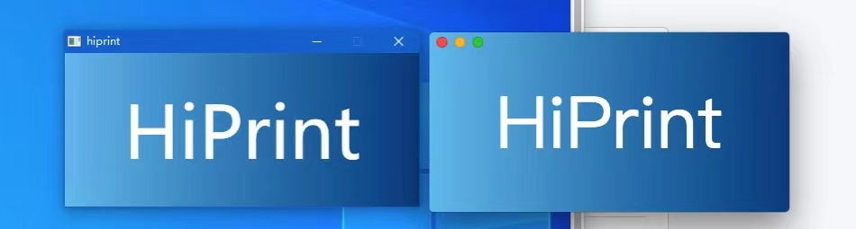
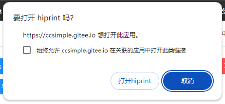

<div align="center" style="margin-top: 10px">
  <a href="http://hiprint.io/">
    
  </a>
  <a href="https://cn.vuejs.org/">
    
  </a>
</div>


<a href="https://gitee.com/CcSimple/vue-plugin-hiprint">

</a>
<a href="https://gitee.com/CcSimple/vue-plugin-hiprint">

</a>


## 关于此插件

vue-plugin-hiprint (基于 [hiprint 2.5.4](http://hiprint.io/)) 当时只是为了方便 <span style="color: red">我（并非 hiprint 原作者）</span> 在 vue 项目中引入使用，所以以此命名。

此 <span style="color: red">插件</span> 仅仅是一个 <span style="color: red">JavaScript【工具库】</span> 而非 <span style="color: yellow">Vue【组件库】</span>，所以它默认不包含 demo 中的那些组件页面（demo 代码可复制使用）。

由于 hiprint 官网最后一次更新时间为 2019 年【hiprint 2.5.4 是 [LGPL](#关于lgpl协议) 协议】，后在诸多使用者及反馈下进行了许多优化调整。

## vue-plugin-hiprint

> [✨ 立即体验(Github 访问慢)](https://ccsimple.github.io/vue-plugin-hiprint/) <br/><br/> [✨ 国内访问(www.ibujian.cn)](https://www.ibujian.cn/) <br/><br/> [🌈 更新日志 (页面支持 Ctrl + F 搜索)](CHANGELOG.md) <br/><br/> [🐛 常见问题(入门必看!)](#常见问题) ⚠️⚠️ [📕 系列教程文章(入门必看!)](#文章链接) <br/><br/> [🚀 项目生态(打印客户端、node 服务端、uniapp)](#插件生态)

> hiprint for Vue2.x / Vue3.x (基于 jQuery, 理论上其他框架可用。[react demo 分支](https://github.com/CcSimple/vue-plugin-hiprint/tree/react_demo))

> **jQuery/uniapp (html/h5)** 项目 见下方 [jQuery/uniapp 项目使用](#jqueryuniapp-项目使用)

> [!IMPORTANT]
>
> **注意事项**
>
> - NodeJs 需要 16.x 版本 (开发使用 16.18.1)
> - <div style="color: red">【vue-plugin-hiprint】与【hiprint.io官网】差异甚多,请忽混用!请忽混用!请忽混用!</div>
> - <div style="color: orange">请使用项目关联的打印客户端,或者自行修改打印客户端的源码,以适配本项目的模板!</div>
> - 主分支是融合版本的最新代码,如果你不需要修改 hiprint 相关代码. 请使用 npm 包的方式安装.
> - 使用直接客户端时,本地开发连接没问题,部署到线上出现跨域无法连接打印客户端问题:
> - [线上跨域问题,请升级 https! 说明:https://www.cnblogs.com/daysme/p/15493523.html](https://www.cnblogs.com/daysme/p/15493523.html)
> - 如需提交 PR 请前往 github 合并后可自动发布 npm 包并同步代码到 gitee
> - vue-plugin-hiprint 包不包含 UI 界面,需要自行处理。如果想更快速引入请查看 [sv-print 组件库](https://www.ibujian.cn/svp/)

## 文章链接

2元快速入门: [一文彻底入门可视化打印 vue-plugin-hiprint](https://mp.weixin.qq.com/s/R8juiaQsLhMmyZebv55tUA)

6元解锁云打印: [三端通用的云打印方案: uniapp + nodejs中转服务！(附源码)](https://mp.weixin.qq.com/s/3_zEsr6nIYAqKdDsKqhg7A)

> 更多文章见公众号、小程序(文章,服务端预览,云打印)

<table>
    <tr>
        <td></td>
        <td></td>
    </tr>
</table>

## 安装使用

```
npm install vue-plugin-hiprint
```

```html
<!--【必须】在index.html 文件中添加打印所需样式(cdn可能不稳定):-->
<link
  rel="stylesheet"
  type="text/css"
  media="print"
  href="https://npmmirror.com/package/vue-plugin-hiprint/files/dist/print-lock.css"
/>
<!-- OR -->
<link
  rel="stylesheet"
  type="text/css"
  media="print"
  href="https://cdn.jsdelivr.net/npm/vue-plugin-hiprint@latest/dist/print-lock.css"
/>
<!-- 可以调整成 相对链接/自有链接, 【重要】名称需要一致 【print-lock.css】-->
<link rel="stylesheet" type="text/css" media="print" href="/print-lock.css" />
```

## 项目截图

<table>
    <tr>
        <td></td>
        <td></td>
    </tr>
    <tr>
        <td></td>
        <td></td>
    </tr>
    <tr>
        <td></td>
        <td></td>
    </tr>
</table>

## 拖拽设计使用(推荐)

```javascript
import { hiprint, defaultElementTypeProvider } from "vue-plugin-hiprint";
// 初始化可拖拽的元素
hiprint.init({
  providers: [new defaultElementTypeProvider()],
});
// $('.ep-draggable-item') 包含 tid, 与上边的 provider 中的 tid 对应 才能正常拖拽生成元素
hiprint.PrintElementTypeManager.buildByHtml($(".ep-draggable-item"));
hiprintTemplate = new hiprint.PrintTemplate({
  template: {}, // 模板json
  settingContainer: "#PrintElementOptionSetting", // 元素参数容器
  paginationContainer: ".hiprint-printPagination", // 多面板的容器， 实现多面板， 需要在添加一个 <div class="hiprint-printPagination"/>
  // ------- 下列是可选功能 -------
  // ------- 下列是可选功能 -------
  // ------- 下列是可选功能 -------
  // 图片选择功能
  onImageChooseClick: (target) => {
    // 测试 3秒后修改图片地址值
    setTimeout(() => {
      // target.refresh(url,options,callback)
      // callback(el, width, height) // 原元素,宽,高
      // target.refresh(url,false,(el,width,height)=>{
      //   el.options.width = width;
      //   el.designTarget.css('width', width + "pt");
      //   el.designTarget.children('.resize-panel').trigger($.Event('click'));
      // })
      target.refresh(
        "",
        {
          // auto: true, // 根据图片宽高自动等比(宽>高?width:height)
          // width: true, // 按宽调整高
          // height: true, // 按高调整宽
          real: true, // 根据图片实际尺寸调整(转pt)
        }
      );
    }, 3000);
    // target.getValue()
    // target.refresh(url)
  },
  // 自定义可选字体
  // 或者使用 hiprintTemplate.setFontList([])
  // 或元素中 options.fontList: []
  fontList: [
    { title: "微软雅黑", value: "Microsoft YaHei" },
    { title: "黑体", value: "STHeitiSC-Light" },
    { title: "思源黑体", value: "SourceHanSansCN-Normal" },
    { title: "王羲之书法体", value: "王羲之书法体" },
    { title: "宋体", value: "SimSun" },
    { title: "华为楷体", value: "STKaiti" },
    { title: "cursive", value: "cursive" },
  ],
  dataMode: 1, // 1:getJson 其他：getJsonTid 默认1
  history: true, // 是否需要 撤销重做功能
  onDataChanged: (type, json) => {
    // 模板发生改变回调
    console.log(type); // 新增、移动、删除、修改(参数调整)、大小、旋转
    console.log(json); // 返回 template
  },
  onUpdateError: (e) => {
    // 更新失败回调
    console.log(e);
  },
});
// 设计器的容器
hiprintTemplate.design("#hiprint-printTemplate");
```

## 代码模式使用(不推荐)

```javascript
import { hiprint, defaultElementTypeProvider } from "vue-plugin-hiprint";
// 引入后使用示例
hiprint.init();
// 下列方法都是没有拖拽设计页面的, 相当于代码模式, 使用代码设计页面
var hiprintTemplate = new hiprint.PrintTemplate();
var panel = hiprintTemplate.addPrintPanel({
  width: 100,
  height: 130,
  paperFooter: 340,
  paperHeader: 10,
});
//文本
panel.addPrintText({
  options: {
    width: 140,
    height: 15,
    top: 20,
    left: 20,
    title: "hiprint插件手动添加text",
    textAlign: "center",
  },
});
//条形码
panel.addPrintText({
  options: {
    width: 140,
    height: 35,
    top: 40,
    left: 20,
    title: "123456",
    textType: "barcode",
  },
});
//二维码
panel.addPrintText({
  options: {
    width: 35,
    height: 35,
    top: 40,
    left: 165,
    title: "123456",
    textType: "qrcode",
  },
});
//长文本
panel.addPrintLongText({
  options: {
    width: 180,
    height: 35,
    top: 90,
    left: 20,
    title: "长文本：hiprint是一个很好的webjs打印,浏览器在的地方他都可以运行",
  },
});
//打印
hiprintTemplate.print({});
```

## vue/vue3 全局引入

> 全局引入，方便在任何地方不引入直接调用打印

```javascript
// main.js中 引入安装
import { hiPrintPlugin } from "vue-plugin-hiprint";
Vue.use(hiPrintPlugin, "$pluginName"); // $pluginName 为自定义名称
hiPrintPlugin.disAutoConnect();

/// 提供的全局方法：

// this.$pluginName == hiprint 全局对象
let hiprintTemplate = this.$pluginName.PrintTemplate({
  template: {}, // 模板json [对象]
});
hiprintTemplate.print({name:'i不简'});

/// provider 不能为null, 可以为 undefined  args: 同模板对应调用 print 方法

// 1. 打印
this.$print(undefined, templateJson, ...args);
this.$print(provider, templateJson, ...args);
// 2. 直接打印
this.print2(undefined, templateJson, ...args);
this.print2(provider, templateJson, ...args);
```

## jQuery/uniapp 项目使用

> uniapp 需要嵌入到 web 浏览器中.(需要支持 window 全局对象环境)

```html
<!-- index.html -->
<head>
  <!-- 打印样式是必须的，你可以调整成自由链接， 注意 media="print"  名称 print-lock.css -->
  <link
    rel="stylesheet"
    type="text/css"
    media="print"
    href="https://unpkg.com/vue-plugin-hiprint@latest/dist/print-lock.css"
  />
  <!-- 下列使用的都是 unpkg提供的 稳定性未知, 建议下载自行处理  -->
  <!-- jquery 必须 -->
  <script src="https://unpkg.com/jquery@3.6.1/dist/jquery.js"></script>
  <!-- 条形码 -->
  <script src="https://unpkg.com/jsbarcode@3.11.5/dist/JsBarcode.all.min.js"></script>
  <!-- 二维码、条形码 bwip-js -->
  <script src="https://unpkg.com/bwip-js@4.5.1/dist/bwip-js.js"></script>
  <!-- 数字转大写 -->
  <script src="https://unpkg.com/nzh@1.0.14/dist/nzh.min.js"></script>
  <!-- 颜色选择器 -->
  <script src="https://unpkg.com/@claviska/jquery-minicolors@2.3.6/jquery.minicolors.min.js"></script>
  <!-- 直接打印(print2)需要 -->
  <script src="https://unpkg.com/socket.io-client@4.5.1/dist/socket.io.min.js"></script>
  <!-- toPdf需要 -->
  <script src="https://unpkg.com/canvg@3.0.10/lib/umd.js"></script>
  <script src="https://unpkg.com/jspdf@2.5.1/dist/jspdf.umd.min.js"></script>
  <script src="https://unpkg.com/html2canvas@1.4.1/dist/html2canvas.js"></script>
  <!-- vue-plugin-hiprint 😃 -->
  <script src="https://unpkg.com/vue-plugin-hiprint@latest/dist/vue-plugin-hiprint.js"></script>
</head>
<body>
  <!-- 注意 defer -->
  <script defer>
    console.log("vue-plugin-hiprint");
    console.log(window["vue-plugin-hiprint"]);
    console.log("hiprint");
    // hiprint 以注入 全局
    console.log(hiprint);
    var autoConnect = window["vue-plugin-hiprint"].autoConnect,
      disAutoConnect = window["vue-plugin-hiprint"].disAutoConnect,
      defaultElementTypeProvider =
        window["vue-plugin-hiprint"].defaultElementTypeProvider;
  </script>
</body>
```

## 常见问题

> 打印重叠 / 样式问题

```javascript
/**
 * 从 在index.html添加:
 * <link rel="stylesheet" type="text/css" media="print" href="https://npmmirror.com/package/vue-plugin-hiprint/files/dist/print-lock.css">
 * 或者
 * <link rel="stylesheet" type="text/css" media="print" href="https://cdn.jsdelivr.net/npm/vue-plugin-hiprint@latest/dist/print-lock.css">
 * 以处理打印所需css, 当然你也可以自行处理
 * 比如： index.html目录下放一个print-lock.css, 然后在index.html添加:
 * <link rel="stylesheet" type="text/css" media="print" href="/print-lock.css">
 */

// 添加自定义样式
hiprintTemplate.print(
  this.printData,
  {},
  {
    styleHandler: () => {
      // 这里拼接成放html->head标签内的css/style
      // 1.例如：使用hiprin官网的样式
      let css =
        '<link href="http://hiprint.io/Content/hiprint/css/print-lock.css" media="print" rel="stylesheet">';
      // 2.重写样式：所有文本红色
      css += "<style>.hiprint-printElement-text{color:red !important;}</style>";
      return css;
    },
  }
);
// 直接打印
hiprintTemplate.print2(this.printData, {
  styleHandler: () => {
    // 这里拼接成放html->head标签内的css/style
    // 1.例如：使用hiprin官网的样式
    let css =
      '<link href="http://hiprint.io/Content/hiprint/css/print-lock.css" media="print" rel="stylesheet">';
    // 2.重写样式：所有文本红色
    css += "<style>.hiprint-printElement-text{color:red !important;}</style>";
    return css;
  },
});
```

> 取消自动 socket 连接 / socket 连接报错问题

```javascript
/**
 * 取消自动连接
 */
// 在main.js中设置
import { hiPrintPlugin } from "vue-plugin-hiprint";
Vue.use(hiPrintPlugin, "$hiprint", false);
// hiPrintPlugin 同时提供了 disAutoConnect 方法
hiPrintPlugin.disAutoConnect();
// 在组件中使用 见： demo/design/index.vue
import { disAutoConnect, autoConnect, hiprint } from "vue-plugin-hiprint";
disAutoConnect();
// 同时 export了 autoConnect，disAutoConnect 方法
/**
 * 连接回调及打印
 */
autoConnect((status, msg) => {
  if (status) {
    hiprintTemplate.print2(printData, {
      printer: "",
      title: "hiprint测试打印",
    });
  }
});
/**
 * socket连接报错？
 * 由于npm包更新到socket.io 3.x版本，官网提供的客户端，npm包是无法连接的
 * 请使用gitee提供的客户端, 同时gitee客户端可传更多的参数， 如是否打印颜色/打印份数/DPI等
 * 详情electron见：https://www.electronjs.org/zh/docs/latest/api/web-contents
 */
```

> print/print2 打印回调

```javascript
// 浏览器预览打印, 无法监听是否点击了 打印/取消 按钮
hiprintTemplate.print(
  this.printData,
  {},
  {
    callback: () => {
      console.log("浏览器打印窗口已打开");
    },
  }
);
// 直接打印
// 打印机名称: 通过 hiprintTemplate.getPrinterList() 获取 其中的 name
hiprintTemplate.print2(printData, { printer: "打印机名称", title: "打印标题" });
hiprintTemplate.on("printSuccess", function (data) {
  console.log("打印完成");
});
hiprintTemplate.on("printError", function (data) {
  console.log("打印失败");
});
```

> 直接打印 地址端口 与 Token 设置

```js
hiprint.init({
  host: "http://localhost:17521", // 可在此处设置连接地址与端口号
  token: "token", // 可在此处设置连接 token 可缺省
});
```

## i18n 设置 ^0.0.55-beta8

原生为简体中文，英语、德语、西班牙语、法语、意大利语、日语、俄语、繁体中文皆为 AI 机翻，欢迎帮助 [订正](https://github.com/CcSimple/vue-plugin-hiprint/tree/main/src/i18n)。

可在 init 时传入语言进行设置，默认为 `cn` 。

```js
hiprint.init({
  lang: "en", // 设置语言 ['cn', 'en', 'de', 'es', 'fr', 'it', 'ja', 'ru', 'cn_tw']
});
```

## 参与项目

```console
git clone https://gitee.com/CcSimple/vue-plugin-hiprint.git

// init
cd vue-plugin-hiprint && npm i

// 调试预览demo
npm run serve

// 打包demo (打包后生成在 demo 目录)
npm run build-demo

// 打包插件(vue-plugin-hiprint 插件资源)
npm run build
```

## demo 调试（显示打印 iframe）

```javascript
// 快速显示/隐藏 打印iframe  方便调试 ￣□￣｜｜
// 在浏览器控制台输入：
// 显示打印页面
$("#app").css("display", "none");
$("#hiwprint_iframe").css("visibility", "visible");
$("#hiwprint_iframe").css("width", "100%");
$("#hiwprint_iframe").css("height", "251.09mm"); // 这里替换个实际高度才能显示完
// 显示vue页面
$("#app").css("display", "block");
$("#hiwprint_iframe").css("visibility", "hidden");
```

## 配套直接打印客户端[electron-hiprint](https://gitee.com/CcSimple/electron-hiprint)

### [electron-hiprint api](./apiDoc.md)

> 使用本项目,请使用如下样子的直接打印客户端

支持 win、mac、linux 系统

> [国内 Gitee 下载](https://gitee.com/CcSimple/electron-hiprint/releases) <br/><br/> [Github 下载](https://github.com/CcSimple/electron-hiprint/releases)



### URLScheme `hiprint://`

> 安装客户端时请 `以管理员身份运行` ，才能成功添加 URLScheme

使用：浏览器地址栏输入 `hiprint://` 并回车



```js
// js
window.open("hiprint://");

// element-ui
this.$alert(
  `连接【${hiwebSocket.host}】失败！<br>请确保目标服务器已<a href="https://gitee.com/CcSimple/electron-hiprint/releases" target="_blank"> 下载 </a> 并 <a href="hiprint://" target="_blank"> 运行 </a> 打印服务！`,
  "客户端未连接",
  { dangerouslyUseHtmlString: true }
);

// ant-design
this.$error({
  title: "客户端未连接",
  content: (h) => (
    <div>
      连接【{hiwebSocket.host}】失败！
      <br />
      请确保目标服务器已
      <a
        href="https://gitee.com/CcSimple/electron-hiprint/releases"
        target="_blank"
      >
        下载
      </a>并<a href="hiprint://" target="_blank">
        运行
      </a>
      打印服务！
    </div>
  ),
});
```

## 使用 [中转服务 node-hiprint-transit](https://github.com/Xavier9896/node-hiprint-transit) 实现代理

配套客户端打印一直存在跨域、无法连接局域网其余打印机、跨网段无法连接的问题，所以诞生了这个中转代理服务。在 `electron-hiprint` [v1.0.0.7](https://gitee.com/CcSimple/electron-hiprint/releases) 版本中添加了连接中转服务代理的设置，将会在 `electron-hiprint` 与 `node-hiprint-transit` 间建立通信，`vue-plugin-hiprint` 只需连接中转服务就能获取到所有连接中转服务的打印端信息，并且选择任意打印机进行打印。

连接中转服务只需要修改 host， 添加 token

```js
import { hiprint } from "vue-plugin-hiprint";

hiprint.init({
  host: "https://v4.printjs.cn:17521", // 此处输入服务启动后的地址
  token: "hiprint-17521", // 用于鉴权的token，hiprint* （*可替换为[0-9a-zA-Z\-_]字符）
});

// or

hiwebSocket.setHost("https://printjs.cn:17521", "vue-plugin-hiprint");
```

具体使用请转至 [node-hiprint-transit](https://github.com/Xavier9896/node-hiprint-transit)

为此你需要作出这些改变：

1. 你可以从 `hiwebSocket` 中获取到 `clients`、`printerList` ，里面都将包含 `client` 信息
2. print2、ippRequest、ippRequest api options 中需要添加 `client` 指定客户端

   eg:

   ```js
   var clientId = "AlBaUCNs3AIMFPLZAAAh";
   var client = hiwebSocket.clients[clientId];
   var printer = hiwebSocket.printerList[0];

   hiprintTemplate.print2(printData, {
     client: clientId,
     printer: client.printerList[n].name,
     title: "hiprint测试打印",
   });

   hiprintTemplate.print2(printData, {
     client: printer.clientId,
     printer: printer.name,
     title: "hiprint测试打印",
   });
   ```

   > 如果你不提供 client 中转服务将抛出一个 error

## 插件生态

| 项目名称                 | 项目地址                                                                                                                 | 下载地址                                                                | 描述                                                               |
| ------------------------ | ------------------------------------------------------------------------------------------------------------------------ | ----------------------------------------------------------------------- | ------------------------------------------------------------------ |
| vue-plugin-hiprint       | [github](https://github.com/CcSimple/vue-plugin-hiprint)、[gitee](https://gitee.com/CcSimple/vue-plugin-hiprint)         | [npm](https://www.npmjs.com/package/vue-plugin-hiprint)                 | 打印设计器                                                         |
| electron-hiprint         | [github](https://github.com/CcSimple/electron-hiprint)、[gitee](https://gitee.com/CcSimple/electron-hiprint)             | [releases](https://github.com/CcSimple/electron-hiprint/releases)       | 直接打印客户端                                                     |
| node-hiprint-transit     | [github](https://github.com/Xavier9896/node-hiprint-transit)、[gitee](https://gitee.com/Xavier9896/node-hiprint-transit) | [releases](https://github.com/Xavier9896/node-hiprint-transit/releases) | web 与客户端中转服务 Node 实现                                     |
| hiprint-transporter-java | [github](https://github.com/LyingDoc/hiprint-transit-java)、[gitee](https://gitee.com/dut_cc/hiprint-transporter-java)   | -                                                                       | web 与客户端中转服务 Java 实现                                     |
| hiprint-transit-java     | [github](https://github.com/weaponready/hiprint-transit-java)                                                            | -                                                                       | web 与客户端中转服务 Java 实现                                     |
| uni-app-hiprint          | [github](https://github.com/Xavier9896/uni-app-hiprint)                                                                  | -                                                                       | uni-app 项目通过 webview 使用 vue-plugin-hiprint demo              |
| node-hiprint-pdf         | [github](https://github.com/CcSimple/node-hiprint-pdf)                                                                   | -                                                                       | 提供通过 node 对 vue-plugin-hiprint 模板生成 矢量 pdf、image、html |


> 带 * 项目为周边社区维护项目，更新迭代、兼容性、稳定性无法得到保证。

## 交流群

<table>
    <tr>
        <td></td>
        <td></td>
    </tr>
</table>

> 群人数已超过 200 请 '加我好友' 备注加群, 邀你进群

## 捐赠支持, 或者请我喝杯咖啡 ☕️

> 如果对您有帮助，请点击右上角 ⭐Star 关注或扫码捐赠，感谢支持开源！

<table>
    <tr>
        <td></td>
        <td></td>
    </tr>
</table>

本项目使用 <a href="https://jb.gg/OpenSourceSupport"></a><a href="https://jb.gg/OpenSourceSupport"></a> 开发

## Star History

[](https://star-history.dera.page/#CcSimple/vue-plugin-hiprint&Date)

## 分支说明

> main： vue2.x + ant1.7.x 融合版 及 npm 包源代码

> npm_demo： vue2.x + ant1.7.x + npm 包使用 示例

> npm_demo_ele： vue2.x + ElementUi 2.x + npm 包使用 示例

> npm_demo_v3： vue3.x + vite + npm 包(0.0.18)使用 示例

## 关于如何融合处理

> 自己融合请查看 vue.config.js 对比 hiprint.bundle.js

> webpack.config.js，是 npm 打包需要处理的

## 开源使用说明

> npm 包是基于 hiprint 官网 2.5.4 版本基础做的调整及优化;<br/>
> 本人对开源协议理解有限,如有侵权不合理的地方,请联系告知我;<br/>

hiprint 开源协议如下:

```
/**
 * jQuery Hiprint 2.5.4
 *
 * Copyright (c) 2016-2021 www.hinnn.com. All rights reserved.
 *
 * Licensed under the LGPL or commercial licenses
 * To use it on other terms please contact us: hinnn.com@gmail.com
 *
 */
```

## 关于 LGPL 协议

```
LGPL是GPL的一个为主要为类库使用设计的开源协议。和GPL要求任何使用/修改/衍生之GPL类库的的软件必须采用GPL协议不同。

LGPL允许商业软件通过类库引用(link)方式使用LGPL类库而不需要开源商业软件的代码。这使得采用LGPL协议的开源代码可以被商业软件作为类库引用并发布和销售。

但是如果修改LGPL协议的代码或者衍生，则所有修改的代码，涉及修改部分的额外代码和衍生的代码都必须采用LGPL协议。

因此LGPL协议的开源代码很适合作为第三方类库被商业软件引用，但不适合希望以LGPL协议代码为基础，通过修改和衍生的方式做二次开发的商业软件采用。

GPL/LGPL都保障原作者的知识产权，避免有人利用开源代码复制并开发类似的产品。
```
